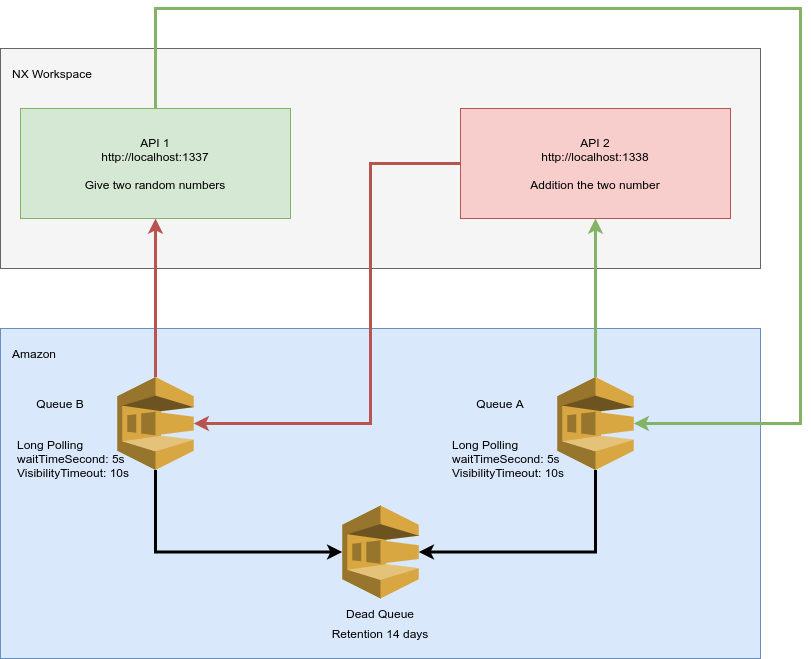
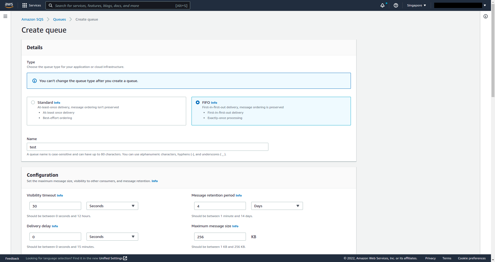
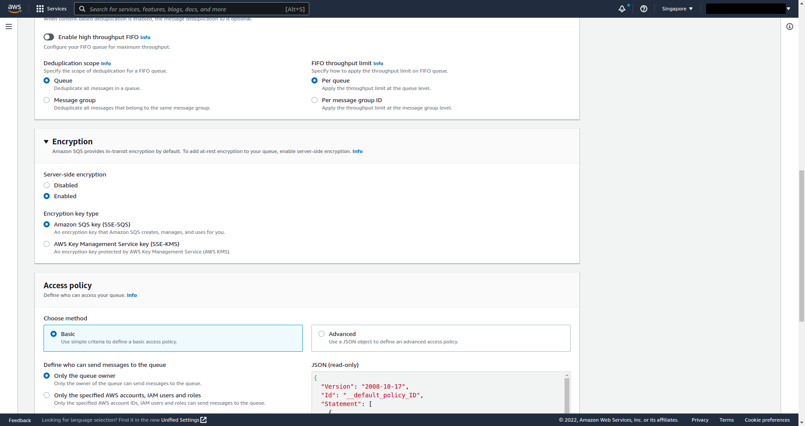
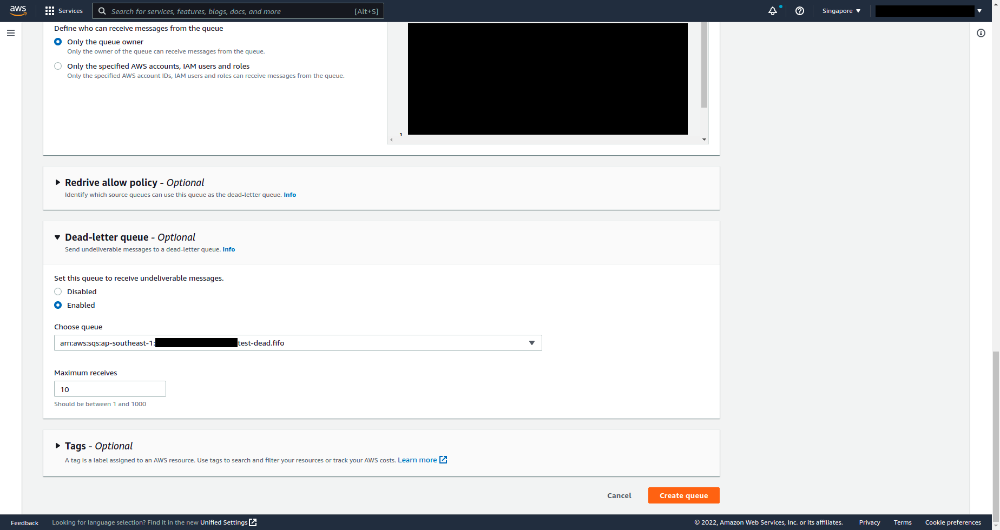
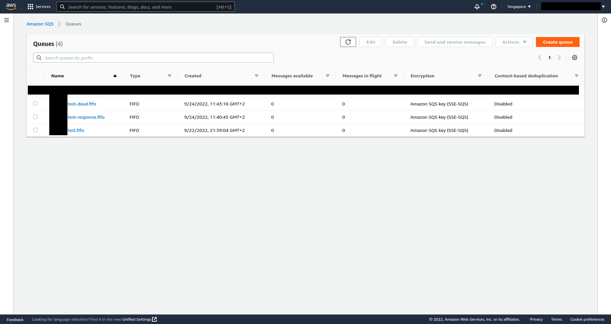
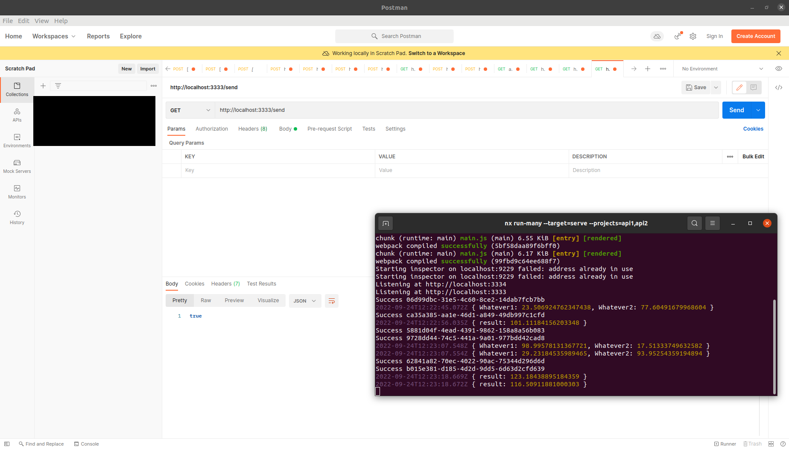

# LABORATORY-AWS-SQS



This laboratory is a little experimentation with Amazon SQS. Using two **Express** apps in a **NX** WorkSpace, I am calculating the addition of two random numbers and passing the information through two SQS queue for creating a Request/Reply pattern. The first app API1 is responsible for giving two random numbers while the second app API2 is responsible for additionning this two numbers and give the result back to API1.

All of my Amazon SQS queue are fifo, so the order is kept and there is no duplication.

## Plan of the presentation

I explain with all the details how I build the project and my way of working.

- [Theory](#theory)
- [Development](#development)
- [Result](#result)
- [Running](#running)
- [System](#system)

## Theory

#### FIFO vs Standard

On Amazon, there are two types of queue FIFO (first-in-first-out) and standard. By default, the queue on Amazon are in standard type. The standard type will try to process as many message as possible, even if it's in not in the right order and might create duplicate messages.

On the other side, the FIFO queue will keep the order of the message but will only be able to handle up to 3k messages per second without batching. With batching, we can go up to 30k messages per seconds.

#### Options

There are a bunch of options possible on the configuration of the queue such as:

- **Retention:** is the time a message will stay on the queue before it gets deleted.
- **MessageGroupId:** Group the message into a group (a group can handle 20k messages max in flight, so be careful)
- **MessageDeduplicationId:** Id of a message, it need to be unique or else no message will be sent.
- **MaxNumberOfMessages:** The number max of message that can be handle when querying the queue
- **WaitTimeSeconds:** The time for polling (meaning the time the connection for polling message will stay open). It avoid querying the queue often like we do in short polling.
- **VisibilityTimeout:** The time a message will be invisible/lock for any other polling. If the message is not handle properly or take too long before getting deleted, it will be treated once again after this time.
- **Dead queue**: A queue where with sent the message that has failed to be deleted after x polling.

## Development

#### Create the queues on Amazon





Once every queue has been created, the result is as follow.

- The `QUEUE A` is the `test.fifo`
- The `QUEUE B` is the `test-response.fifo`
- The `DEAD QUEUE` is the `test-dead.fifo`



#### Explanation

I have developed the whole connection between SQS and my app through a library in `libs/queue/src/lib/queue.ts`.

For creating alib, I use the command from NX:

```bash
npx nx g @nrwl/node:lib queue
```

There are 3 exported functions:

- **sendMessage**: Use for sending a message to one of the queue
- **receiveMessage**: Use for receving the messages, it will be loop with a certain time define by the constant `REFRESH_TIMEOUT_IN_SECOND`. This is the function responsible for the polling. Once the message is polled, it passed to the callback function sent through the params and then the message is deleted from the poll.
- **deleteMessage**: use for deleting the message that has been polled. This is use by the receiveMessage so it did not need to be exported.

In API1, I have created a endpoint for sending the two numbers on the `QUEUE A` using the sendMessage function from the library. I have also used the receiveMessage to create a polling on the `QUEUE B`. The code is located in `apps/api1/src/app/experience.ts`.

In the API2, there is less stuff since I did not have to create an endpoint. This api is only responsible for sending the result back to the `QUEUE B`. So I use the receiveMessage function for polling the message from the `QUEUE A`. Once I received something, I do my calculation and send back the result using the `sendMessage` to the `QUEUE B`.

Many message can be sent and they will all be handle properly. This is the magic behind decoupling and SQS. The time for receiving and sending a message is 10s but it can be change with `REFRESH_TIMEOUT_IN_SECOND`

## Result

I can now see on my Postman the result of my call: http://localhost:1337/send



## Running

I am using NX, so for starting the project use the following command:

```bash
$ nx serve api
```

For testing the app, use Postman.

## System

Ubuntu Version: Ubuntu 20.04.1 LTS
Node Version: v16.15.1

```bash
# Get the version of node
$ node -v

# Get the latest version of ubuntu
$ lsb_release -a
```
